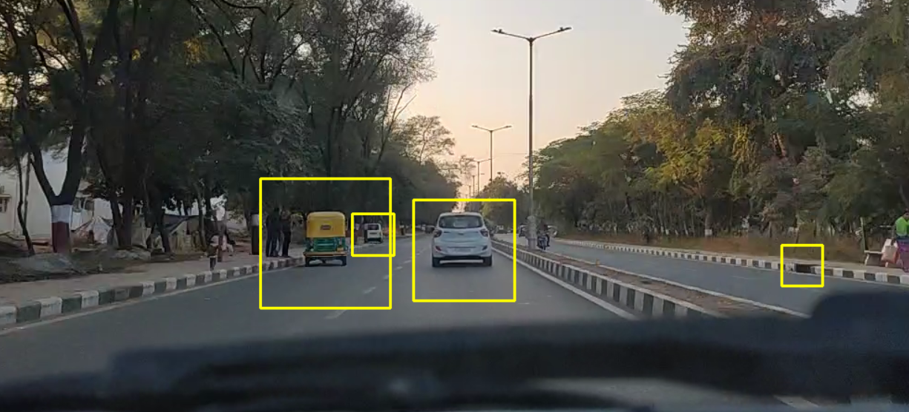

# Car and Pedestrians Detection on Road

This project aims to detect cars on roads using computer vision techniques. It utilizes OpenCV and Matplotlib libraries in Python to analyze video footage, detect cars, and draw bounding boxes around them.

## Setup and Dependencies
- Ensure you have Python installed on your system.
- Install the required libraries using the following command:
  `pip install requirements.txt`
- Download the cascade classifier files (e.g., `cars.xml`, `pedestrian.xml`) for detecting cars and pedestrians.

## How it Works
- The program reads a video file (`video.mp4`) frame by frame.
- It applies background subtraction to isolate moving objects from the background.
- Utilizing cascade classifiers, it detects cars and pedestrians within each frame.
- Bounding boxes are drawn around the detected cars.

- Optionally, it can detect lanes on the road using **Canny edge detection** and **Hough transform**.

## Usage
1. Ensure the video file (`video.mp4`) and cascade classifier files (`cars.xml`, `pedestrian.xml`) are in the project directory.
2. Run the script `car_detection.py`.
3. The program will display the video with detected cars.

## Additional Functionality
- To visualize lane detection, uncomment the relevant sections in the script.
- Press 'q' to exit the video stream.

## Notes
- Fine-tune the parameters in the script (e.g., scale factor, minimum neighbors) for optimal car detection.
- For better performance, consider using a GPU-accelerated version of OpenCV (cv2.cuda) if available.

## Acknowledgements
- Special thanks to the contributors of OpenCV and Matplotlib for providing powerful tools for image processing and visualization.

For any issues or suggestions, feel free to open an issue or drop me an email.